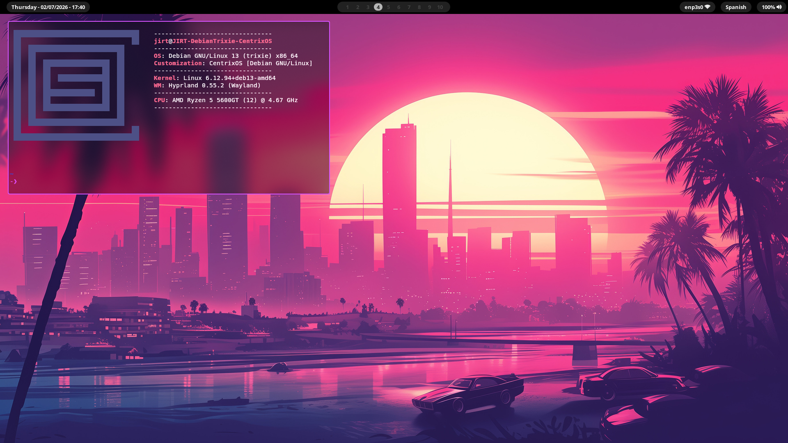

# Bienvenidos a CentrixOS
Centrix es una capa de personalización creada para sistemas GNU/Linux con entorno de escritorio Hyprland. https://jirt2007.github.io/webCENTRIX/
CentrixOS busca ofrecer una capa de personalización pre configurada para sistemas operativos GNU/Linux usando el entorno de escritorio Hyprland basado en Wayland y cuyo mayor atractivo son las funciones para ubicar en modo tilling los programas que ejecutemos.
El proyecto busca por filosofia mantenerse lo mas simple y sobrio posible, instalando el software necesario para el correcto uso de las funciones y manteniendo el script de instalación de CentrixOS basado en Shell Script y con una sintaxis simple y sin complejidad, esto beneficia en la estabilidad que nos certifican los sistemas GNU/Linux y en la auditabilidad eficiente de las configuraciones e instalación sin negar el tener un entorno de escritorio basado en Hyprland pre configurado y funcional para desarrollo, ofimatica, multimedia, etc.
CentrixOS recibe inpiraciones en el proyecto Omarchy desarrollado por DHH por lo que se agradece al creador por la inspiración y se le felicita por el proyecto que ha desarrollado.

### Recomendaciones:
- No ejecute el comando de la forma `sudo ./centrixOS/install.sh`, es preferible asignarle previamente permisos de ejecución.
- Se recomienda previo a la instalación sobre hardware fisico, realizar una instalación y pruebas sobre una Virtual Machine.
- Luego de instalada la capa de personalización se recomienda reiniciar el equipo.
- Se recomienda realizar la instalacion de CentrixOS sobre un sistema GNU/Linux recien instalado y preferiblemente en modo TTY.

### Developer:
 **JIRT2007**

